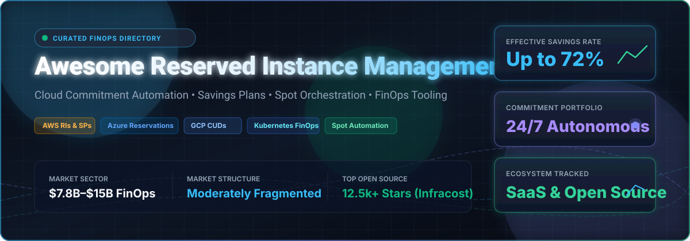
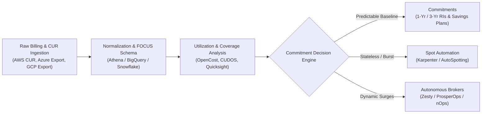

  

  
  
  
  
  
  

---

# ⚡ Awesome Reserved Instance Management

> 🌟 **A definitive, community-curated list of enterprise SaaS platforms, FinOps automation software, and open-source GitHub projects for optimizing AWS Reserved Instances (RI), Savings Plans (SP), Azure Reservations, Google Cloud Committed Use Discounts (CUD), and Spot instance capacity.**

---

## 📑 Table of Contents

- [☁️ Overview & FinOps Architecture](#️-overview--finops-architecture)
- [🏢 SaaS/Hosted Commitment Management Platforms](#-saashosted-commitment-management-platforms)
- [🛠️ Open-Source GitHub Projects](#️-open-source-github-projects)
- [🏗️ Frameworks for Custom FinOps Automation](#️-frameworks-for-building-custom-systems)
- [🤝 How to Contribute](#-how-to-contribute)
- [⭐ Star History](#-star-history)
- [⚖️ Disclaimer](#️-disclaimer)

---

## ☁️ Overview & FinOps Architecture

Cloud compute spending represents one of the largest operating expenses in modern engineering organizations. While on-demand compute provides maximum agility, relying entirely on on-demand rates incurs a steep 30% to 72% pricing premium. 

**Cloud Commitment Management** bridges the gap between infrastructure flexibility and financial efficiency:
- 🏷️ **AWS**: Standard Reserved Instances (RIs), Convertible RIs, Compute Savings Plans (CSP), and EC2 Instance Savings Plans.
- 🔷 **Microsoft Azure**: Azure Reserved Virtual Machine Instances (Reservations) and Azure Compute Savings Plans.
- 🌐 **Google Cloud (GCP)**: Resource-based Committed Use Discounts (CUDs) and Flexible Spend-based CUDs.
- ⚡ **Spot / Preemptible Instances**: Dynamic interruptible compute orchestration for fault-tolerant and stateless workloads.

This repository tracks the leading **commercial SaaS solutions** that provide autonomous 24/7 portfolio risk-balancing, alongside **open-source tooling** for cost telemetry, IaC budget checks, and Spot automation.

---

## 🏢 SaaS/Hosted Commitment Management Platforms

> 📊 **Market Size & Industry Structure:** The global Cloud Cost Management and FinOps market is valued at **$7.8B–$15B in 2025/2026** (projected to exceed **$25B–$38B by 2032–2034** at an ~18% CAGR). The sector is **moderately fragmented** rather than a winner-take-all monopoly: legacy enterprise infrastructure conglomerates (Broadcom, IBM, NetApp, Flexera) maintain sizable market footprints via multi-billion-dollar acquisitions, while innovative independent specialists (Zesty, ProsperOps, nOps, Vantage, Finout, CloudKeeper) capture rapid market share through autonomous algorithms, AI rightsizing, and continuous portfolio rebalancing.

The table below is sorted in **descending order by company scale** (revenue, valuation, and parent organization capitalization):

| Platform | Company Size (Revenue / Valuation) | Description | Pricing (Starting Tier) | Free Tier / Free Trial Limits |
| :--- | :--- | :--- | :--- | :--- |
| **[CloudHealth](https://www.cloudhealthtech.com/)** *(Broadcom / VMware)* | **Parent: Broadcom** • Market Cap: **$700B+** • Annual Rev: **$50B+** *(CloudHealth acquired for ~$500M; VMware acquired for $69B)* | Enterprise multi-cloud governance and FinOps platform providing RI/Savings Plan recommendations, cost allocation, and policy enforcement across AWS, Azure, and GCP. | Starts at ~2.2%–2.5% of monthly managed cloud spend (or tiered plans starting at ~$1,000–$3,000/mo for up to $100K–$150K spend; typically 1–3 yr term; $0.03/dollar overage) | 7-day to 14-day free trial on AWS Marketplace / sales-led POC with full multi-cloud visibility and anomaly detection (no permanent free tier) |
| **[Cloudability](https://www.apptio.com/products/cloudability/)** *(Apptio / IBM)* | **Parent: IBM** • Market Cap: **$200B+** • Annual Rev: **$62B+** *(IBM acquired Apptio for $4.6B; Cloudability acquired for ~$150M)* | Enterprise FinOps and cloud financial management platform delivering visibility, unit economics, budget governance, and multi-cloud commitment planner recommendations. | Starting tier at $30,000/year (~$2,500/month) for up to $1M in managed annual cloud spend (~3.0% effective rate; scales to $76,680/year for $3M spend, plus overage charges) | 14-day free trial with full access to cost allocation, anomaly detection, and commitment planning across connected cloud provider accounts |
| **[Spot by NetApp](https://spot.io/)** | **Parent: NetApp** • Market Cap: **$25B+** • Annual Rev: **$6.3B+** *(NetApp acquired Spot.io for ~$450M in 2020)* | Cloud operations and optimization suite specializing in automated Spot instance scaling (Elastigroup, Ocean) and continuous RI/Savings Plan commitment management (Eco). | Pay-as-you-go per 100 vCPU-hours for compute automation, or ~15%–20% of realized savings for Eco RI management (annual contract baseline averages ~$17,000/year / ~$1,400/mo) | 14-day full feature free trial on AWS Marketplace; followed by a permanent freemium tier for up to 20 virtual machines (VMs) |
| **[ProsperOps](https://www.prosperops.com/)** | **Parent: Flexera** • Valuation: **$3B+** • Annual Rev: **$400M+** *(Raised $24M Series A prior to 2024 Flexera acquisition)* | Autonomous Discount Management (ADM) software executing real-time, programmatic purchasing and rebalancing of Reserved Instances and Savings Plans to maximize Effective Savings Rate (ESR). | Starts at 30%–35% of realized net savings (scales down with volume/multi-year commitment; baseline min. ~$200k/year cloud spend / ~$15,000/yr; ARM Scheduler billed at flat fee per resource/mo) | Free Savings Analysis (quantifies historical discount performance, Effective Savings Rate, and potential savings within 24 hours with read-only IAM; no permanent free automated execution tier) |
| **[Zesty](https://zesty.co/)** | **Valuation: ~$428M** • Total Raised: **$116M** *(Series B led by B Capital)* • Est. ARR: **$25M–$40M** | Automated AI cloud infrastructure optimization platform featuring Commitment Manager for automated discount rebalancing and Zesty Disk for dynamic EBS volume autoscaling. | Starts at ~20%–25% of net savings generated (or base platform fee starting at ~$500/month + $5/vCPU for storage/compute management) | 30-day evaluation trial with full telemetry access; complimentary automated cloud savings analysis and audit (no permanent free tier) |
| **[CloudKeeper](https://www.cloudkeeper.com/)** | **Annual Rev: $200M** • EBITDA: **$20M** *(Hived off as an independent global FinOps entity from TO THE NEW)* | Turnkey cloud cost optimization and FinOps platform providing guaranteed commitment discounts of up to 15%–25% through aggregated RI volume pools without lock-in risk. | CloudKeeper Commit starts at 18% of savings delivered; CloudKeeper Lens/Tuner starts at 1%–2% of monthly cloud spend (CloudKeeper AZ offers guaranteed 15%–25% savings with $0 upfront fee) | 30-day free trial for CloudKeeper Lens, Tuner, and Commit with full cost visibility, waste detection, and savings discovery |
| **[Finout](https://www.finout.io/)** | **Valuation: ~$120M–$180M** • Total Raised: **$85M** *(Series C in 2025; Series B led by Red Dot Capital)* • Est. ARR: **$10M+** | Cloud cost observability platform featuring MegaBill, granular Kubernetes/Snowflake/Datadog allocation, unit economics, chargeback/showback, and automated commitment optimization. | Starts at ~$1,000/month (billed annually as a predictable flat fee based on committed cloud spend tiers, with $0 overage fees and no percentage-of-spend) | 14-day free trial with full feature access and unlimited connected cloud accounts (no permanent free tier) |
| **[Vantage](https://vantage.sh/)** | **Valuation: ~$120M–$150M** • Total Raised: **$25M** *(Series A led by Scale Venture Partners)* • Est. ARR: **$18M** | Modern cloud cost transparency platform delivering multi-cloud visibility, virtual tagging, financial reporting, anomaly detection, and automated savings recommendations. | Free tier available ($0/month); paid plans start at $30/month (Pro tier, up to $7,500/mo spend), and $200/month (Business tier, up to $20,000/mo spend) | Free forever plan for up to $2,500/month in tracked cloud spend (up to 3 users and 6 months data retention); plus a 14-day free trial on Pro & Business plans |
| **[nOps](https://www.nops.io/)** | **Valuation: ~$100M–$150M** • Total Raised: **$40M** *(Series A led by Headlight Partners)* • Est. ARR: **$5M–$10M** | AI-native FinOps platform that automates AWS and Azure commitment management, executes Spot instance orchestration, and provides continuous cost allocation. | Starts at $149/month for Cost Visibility & Allocation; Autonomous Rate Optimization charges a share of realized net savings (typically ~20% of net savings delivered) | 14-day free trial with full access to cost visibility, allocation, and reporting tools, plus a complimentary 30-minute cloud savings analysis |
| **[Densify](https://www.densify.com/)** | **Valuation: ~$100M** • Total Raised: **$62.2M** • Est. ARR: **$25M+** *(Won $84M willful patent verdict against VMware)* | Machine learning-driven resource optimization and densification platform analyzing workload patterns to recommend precise sizing, container limits, and commitment architectures. | Starts at $2.50/instance/month (minimum commitment of 2,000 instances / ~$5,000/month) or $2.00/vCPU/month for Kubernetes (1,000 vCPUs minimum) | 60-day full-featured free trial with complete cloud and container sizing recommendations across your infrastructure |

---

## 🛠️ Open-Source GitHub Projects

> 💡 **Open-Source Reality in FinOps:** While fully autonomous, risk-underwritten commitment trading is dominated by commercial platforms due to balance sheet requirements and liquidation liability, the open-source community provides best-in-class tools for **IaC cost forecasting, Kubernetes autoscaling, idle resource reclamation, and multi-cloud billing analysis**.

The repositories below are **sorted in descending order by GitHub star count**:

1. 💸 **[Infracost](https://github.com/infracost/infracost)**   
   Cloud cost estimates for Terraform, Pulumi, and IaC directly in pull requests, allowing platform engineers to catch accidental cloud budget overruns before infrastructure is deployed.

2. ⚡ **[Karpenter (AWS Provider)](https://github.com/aws/karpenter-provider-aws)**   
   Open-source Kubernetes node provisioning and autoscaling engine that rapidly selects right-sized compute, provisions Spot instances dynamically, and minimizes waste across Reserved Instances and Savings Plans portfolios.

3. ☸️ **[OpenCost](https://github.com/opencost/opencost)**   
   CNCF-hosted open-source vendor-neutral Kubernetes cost monitoring engine providing real-time container cost allocation, network egress pricing, and resource consumption metrics.

4. 🛡️ **[Cloud Custodian](https://github.com/cloud-custodian/cloud-custodian)**   
   Lightweight, open-source rules engine for multi-cloud security and cost management that automatically stops idle EC2/RDS instances during non-working hours, cleans detached EBS volumes, and enforces tagging policies.

5. 🔍 **[ec2instances.info](https://github.com/vantage-sh/ec2instances.info)**   
   The definitive open-source EC2 pricing, Reserved Instance terms, and Savings Plans comparison matrix, widely used by FinOps teams and infrastructure architects worldwide.

6. 🗺️ **[Cartography (Lyft)](https://github.com/lyft/cartography)**   
   Python-based open-source graph mapping tool that consolidates infrastructure assets, accounts, and services to expose zombie servers, untagged resources, and commitment waste.

7. 🔄 **[Terracognita (Cycloid)](https://github.com/cycloidio/terracognita)**   
   Reverse-engineering engine that scans existing AWS, GCP, and Azure cloud infrastructures and exports them into Terraform definitions, illuminating uncommitted compute drift.

8. 🎯 **[AutoSpotting](https://github.com/LeanerCloud/AutoSpotting)**   
   Autonomous open-source tool that continuously inspects AWS Auto Scaling groups and replaces expensive on-demand instances with compatible Spot instances without modifying Auto Scaling launch templates.

9. 📊 **[OptScale (Hystax)](https://github.com/hystax/optscale)**   
   Open-source FinOps platform supporting AWS, Azure, GCP, Alibaba Cloud, and Kubernetes with multi-cloud cost visibility, commitment coverage tracking, and anomaly alerts.

10. 🌿 **[kube-green](https://github.com/kube-green/kube-green)**   
    CNCF landscape Kubernetes controller that automatically scales down non-production pods during non-working hours, saving up to 70% of staging and development compute bills.

11. 📉 **[Terraform Cost Estimation](https://github.com/antonbabenko/terraform-cost-estimation)**   
    Popular GitHub Action and CLI for estimating cost differences in Terraform code directly in GitHub PRs using pricing APIs and structured infracost telemetry.

12. 🧰 **[FinOps Toolkit (Microsoft)](https://github.com/microsoft/finops-toolkit)**   
    Microsoft open-source repository offering automation templates, Power BI report packs, and data pipelines to implement FinOps practices and ingest FOCUS-compliant cost data.

13. 📈 **[Cloud Intelligence Dashboards / CUDOS (AWS)](https://github.com/aws-solutions-library-samples/cloud-intelligence-dashboards-framework)**   
    AWS open-source framework deploying operational QuickSight dashboards (CUDOS, Cost Intelligence Dashboard, Compute Optimizer Dashboard) for deep analysis of CUR data, RIs, and Savings Plans.

14. 📐 **[FOCUS Specification (FinOps Foundation)](https://github.com/FinOps-Open-Cost-and-Usage-Spec/FOCUS_Spec)**   
    The official open-source FinOps Open Cost and Usage Specification establishing vendor-neutral billing schema definitions to make cost data interchangeable across AWS, Azure, GCP, and SaaS vendors.

---

## 🏗️ Frameworks for Building Custom Systems

For organizations desiring an internal commitment optimization architecture:

1. **Telemetry & Ingestion**: Export detailed Cost and Usage Reports (CUR) to S3, Google Cloud Storage, or Azure Blob Storage.
2. **Standardization**: Parse data against the **FOCUS 1.0+** format to achieve uniform dimensions across clouds.
3. **Rightsizing & Waste Elimination**: Prioritize eliminating idle storage, unattached elastic IPs, and over-provisioned memory before locking into commitments.
4. **Portfolio Layering**:
   - *Base Layer*: 1-Year or 3-Year Compute Savings Plans covering steady-state baseline consumption (50%–70% of compute).
   - *Middle Layer*: Standard or Convertible Reserved Instances targeted at static, predictable database/compute instances.
   - *Dynamic Peak Layer*: Spot capacity managed with automated interrupter handlers (Karpenter) or autonomous AI commitment managers with guaranteed buybacks.

---

## 🤝 How to Contribute

Contributions are warmly encouraged! Help keep this FinOps repository the most accurate resource on the web:

1. 🍴 **Fork** this repository.
2. 🌿 **Create a branch**: `git checkout -b add-finops-tool`.
3. 📝 **Add your entry** to the appropriate section following the existing markdown schema:
   - For SaaS tools: Include platform name, parent company/valuation, description, starting pricing, and exact free tier/trial limits.
   - For Open-Source projects: Include valid GitHub repository link, star badge (`style=social&color=white`) linking to stargazers, and a concise summary.
4. 🚀 **Submit a Pull Request** with a clear explanation of your change.

---

## ⭐ Star History

---

## ⚖️ Disclaimer

- This is a **community-curated** list intended solely for educational, technical, and informational purposes. It does not constitute financial, investment, or FinOps consulting advice.
- Cloud commitment purchases (RIs, Savings Plans, CUDs) are legally binding financial obligations with hyperscale providers. Always audit your real workload volatility and risk tolerances before entering multi-year contracts.
- Product pricing, features, company valuations, and terms of service fluctuate over time. Verify current terms directly with vendor documentation.

---

  <b>Built for FinOps Practitioners, Cloud Architects, and Platform Engineers worldwide.</b> 
  <i>Maximizing cloud efficiency while safeguarding architectural agility.</i>

